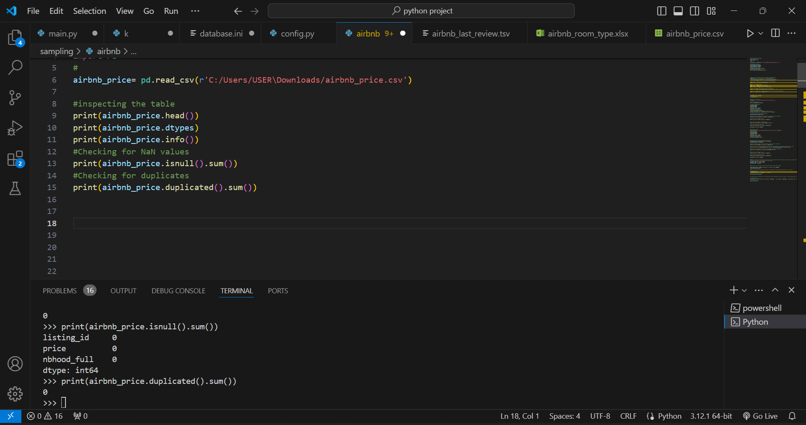
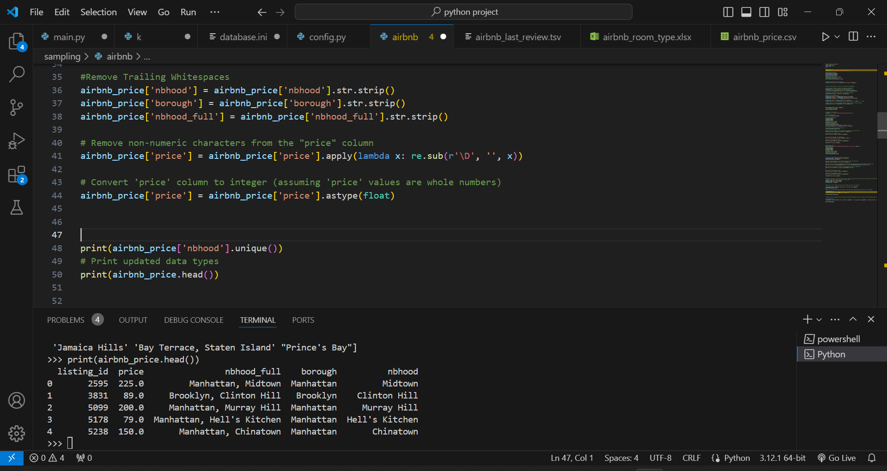
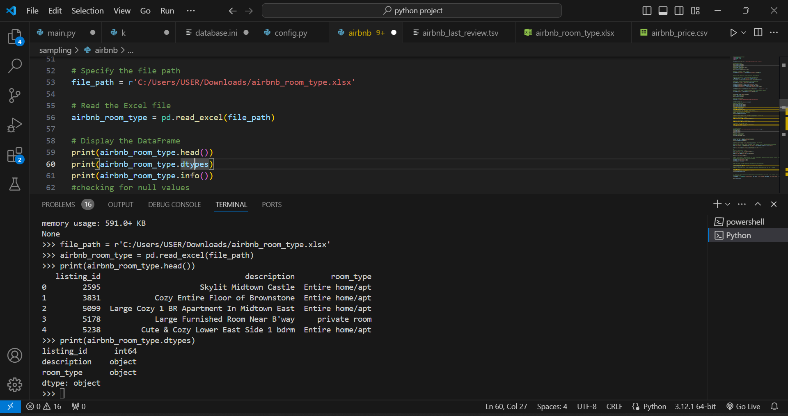
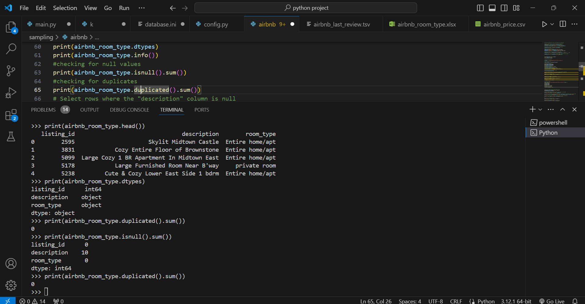
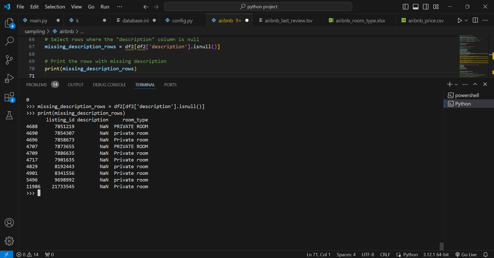
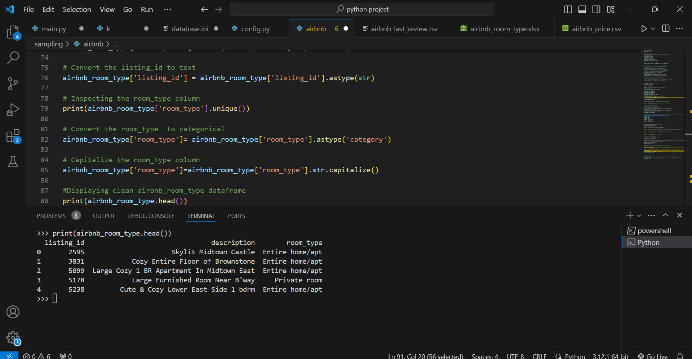

# Exploring Airbnb Market Trends


## Project Description

New York City has a variety of Airbnb listings to meet the high demand for temporary lodging for travelers, with several different price levels, room types, and locations. As a consultant working for a real estate start-up, I have collected Airbnb listing data from various sources to investigate the short-term rental market in New York. I'll analyze this data to provide insights on private rooms to the real estate company.

**_Disclaimer_**: _The dataset used in this project is obtained from (DataCamp.com) to demonstrate the capabilities of Python. You can access the dataset [here](https://app.datacamp.com/learn/projects/exploring-airbnb-market-trends/guided/Python)._

## About Dataset
There are three files in the data folder: **_airbnb_price.csv_**, **_airbnb_room_type.xlsx_**, **_airbnb_last_review.tsv_**.

### data/airbnb_price.csv 
This is a CSV file containing data on Airbnb listing prices and locations.

1. listing_id: unique identifier of listing
2. price: nightly listing price in USD
3. nbhood_full: name of borough and neighborhood where listing is located

### data/airbnb_room_type.xlsx 

This is an Excel file containing data on Airbnb listing descriptions and room types.

1. listing_id: unique identifier of listing
2. description: listing description
3. room_type: Airbnb has three types of rooms: shared rooms, private rooms, and entire homes/apartments

### data/airbnb_last_review.tsv 

This is a TSV file containing data on Airbnb host names and review dates.

1. listing_id: unique identifier of listing
2. host_name: name of listing host
3. last_review: date when the listing was last reviewed

## Problem Statemnt
1. What are the dates of the earliest and most recent reviews? Store these values as two separate variables with your preferred names.
2. How many of the listings are private rooms? Save this into any variable.
3. What is the average listing price? Round to the nearest two decimal places and save into a variable.
4. Combine the new variables into one DataFrame called review_dates with four columns in the following order: first_reviewed, last_reviewed, nb_private_rooms, and avg_price. The DataFrame should only contain one row of values.

## Skills Demonstrated
1. Importing and cleaning data
2. Data manipulation
3. Report insights to a real estate start-up!


## Data Cleaning

```python
# Import necessary packages
import pandas as pd
import numpy as np
import re
# importing data/airbnb_price.csv
airbnb_price= pd.read_csv(r'C:/Users/USER\Downloads/airbnb_price.csv')
```
#### airbnb price dataframe head


After inspecting the airbnb_price table and seeing that it consists of 3 columns:
1. listing_id 
2. price
3. nbhood_full
We need to make sure that the columns  are in the correct format and cleaned
### Checking for NaN and Duplicated Values



###
```python

# Convert 'listing_id' column to text
airbnb_price['listing_id'] = airbnb_price['listing_id'].astype(str)


#splitting the nbhooh_full column into borough and neighborhood 

# Define a regex pattern to capture borough and neighborhood
regex_pattern = r'(?P<Borough>\w+),\s(?P<Neighborhood>.*)'
# Extract borough and neighborhood into new columns using regex
df_extracted = airbnb_price['nbhood_full'].str.extract(regex_pattern)

# Assign the extracted columns back to the oriinal DataFrame
airbnb_price[['borough', 'nbhood']] = df_extracted

#Remove Trailing Whitespaces
airbnb_price['nbhood'] = airbnb_price['nbhood'].str.strip()
airbnb_price['borough'] = airbnb_price['borough'].str.strip()
airbnb_price['nbhood_full'] = airbnb_price['nbhood_full'].str.strip()

# Remove non-numeric characters from the "price" column
airbnb_price['price'] = airbnb_price['price'].apply(lambda x: re.sub(r'\D', '', x))

# Convert 'price' column to integer (assuming 'price' values are whole numbers)
airbnb_price['price'] = airbnb_price['price'].astype(float)


print(airbnb_price['nbhood'].unique())
# Print updated data types
print(airbnb_price.head())

```



Now moving on to the airbnb_room_type Dataframe

#### airbnb room_type dataframe head

After inspecting the airbnb_room_type table and seeing that it consists of 3 columns:
1. listing_id
2. description
3. room_type
We need to make sure that the columns  are in the correct format and cleaned

### Checking for NaN and Duplicated Values



Upon inspection, it was observed that the **description** column contains **10** missing values. To gain further insights into the nature of this missingness, a closer examination was conducted.



It was found that the missing values in the **description** column are exclusively associated with listings categorized as "Private Room" in the **room_type** column. This suggests that certain clients opt not to provide additional information when renting out private rooms, possibly indicating a preference for privacy and discretion in such arrangements.

so now we deal with the missing values and convert the listing_id column to text 
```python
# Replace missing values in the "description" column with "not specified"
airbnb_room_type['description'].fillna("not specified", inplace=True)
# Convert the listing_id to text
airbnb_room_type['listing_id'] = airbnb_room_type['listing_id'].astype(str)

```
### inspecting the room_type column 
```python
print(airbnb_room_type['room_type'].unique())
```
 *It seems like there are inconsistencies in the values of the "room_type" column, with variations in capitalization. To address this, I Captilized everything to ensure consistency.*
### converting it to categorical column and capitlzing everything to ensure consistency
```python
# Inspecting the room_type column
print(airbnb_room_type['room_type'].unique())

# Convert the room_type  to categorical
airbnb_room_type['room_type']= airbnb_room_type['room_type'].astype('category')

# Capitalize values in the 'room_type' column 
airbnb_room_type['room_type'] = airbnb_room_type['room_type'].str.capitalize()

# Print the unique values in the 'room_type' column again
print(airbnb_room_type['room_type'].unique())
#Displaying clean airbnb_room_type dataframe
print(airbnb_room_type.head())
```
### Displaying The clean airbnb_room_type DataFrame



Now moving on to the **_airbnb_review_** table
## Inspecting The Table
```python
#creating airbnb_review table
airbnb_review=pd.read_csv(r'C:/Users/USER/Downloads/airbnb_last_review.tsv',sep='\t')
#inspecting table
print(airbnb_review.head())
print(airbnb_review.dtypes)
print(airbnb_review.info())
```


### checking for null and duplicated values 
```python
print(airbnb_review.isnull().sum())

print(airbnb_review.duplicated().sum())
```


**_It appears that the "host_name" column has 8 missing values.I am going to replace them with "not specified"_**
```python
# Replace missing values in the "host_name" column with "not specified"
airbnb_review['host_name'].fillna("not specified", inplace=True)
```

### dealing with other columns 

``` python

# Convert the 'last_review' column to datetime format, handling errors by setting invalid values to NaT
airbnb_review['last_review']= pd.to_datetime(airbnb_review['last_review'],infer_datetime_format=True,errors='coerce')

# Convert the 'last_review' column to string format with date in DD-MM-YYYY
airbnb_review['last_review']=airbnb_review['last_review'].dt.strftime("%d-%m-%Y")

#
# Convert the listing_id to text
airbnb_review['listing_id'] = airbnb_review['listing_id'].astype(str)

# Capitalize the room_type column
airbnb_review['host_name']=airbnb_review['host_name'].str.capitalize()

print(airbnb_review['host_name'].unique())

```


# Now Answering the questions

```python
###What are the dates of the earliest and most recent reviews? Store these values as two separate variables with your preferred names
# Calculate the most recent and earliest review dates
max_date = airbnb_review['last_review'].max()
min_date = airbnb_review['last_review'].min()
print(max_date , min_date)


##How many of the listings are private rooms? Save this into any variable.

count_private_room = airbnb_room_type[airbnb_room_type['room_type'] == 'Private room'].shape[0]
print(count_private_room)

##What is the average listing price? Round to the nearest two decimal places and save into a variable.

print(airbnb_price.head())
average_listing_price= round(airbnb_price['price'].mean(),2)

print(average_listing_price)


## Combine the new variables into one DataFrame called review_dates with four columns in the following order: first_reviewed, last_reviewed, nb_private_rooms, and avg_price. The DataFrame should only contain one row of values.

# Create DataFrame
review_dates = pd.DataFrame({'first_reviewed': [min_date] , 'last_reviewed': [max_date], 'nb_private_rooms' : [count_private_room] ,'avg_price': [average_listing_price]})

print(review_dates)
```
