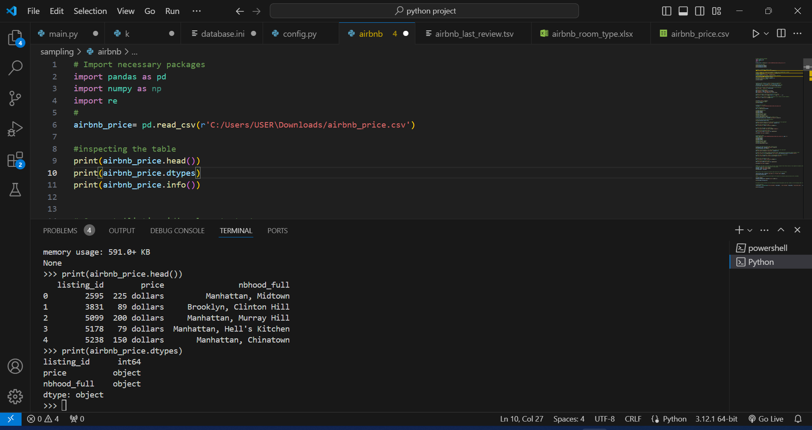

# Exploring Airbnb Market Trends


## Project Description

New York City has a variety of Airbnb listings to meet the high demand for temporary lodging for travelers, with several different price levels, room types, and locations. As a consultant working for a real estate start-up, I have collected Airbnb listing data from various sources to investigate the short-term rental market in New York. I'll analyze this data to provide insights on private rooms to the real estate company.

**_Disclaimer_**: _The dataset used in this project is obtained from (DataCamp.com) to demonstrate the capabilities of Python. You can access the dataset [here](https://app.datacamp.com/learn/projects/exploring-airbnb-market-trends/guided/Python)._

## About Dataset
There are three files in the data folder: **_airbnb_price.csv_**, **_airbnb_room_type.xlsx_**, **_airbnb_last_review.tsv_**.

### data/airbnb_price.csv 
This is a CSV file containing data on Airbnb listing prices and locations.

1. listing_id: unique identifier of listing
2. price: nightly listing price in USD
3. nbhood_full: name of borough and neighborhood where listing is located

### data/airbnb_room_type.xlsx 

This is an Excel file containing data on Airbnb listing descriptions and room types.

1. listing_id: unique identifier of listing
2. description: listing description
3. room_type: Airbnb has three types of rooms: shared rooms, private rooms, and entire homes/apartments

### data/airbnb_last_review.tsv 

This is a TSV file containing data on Airbnb host names and review dates.

1. listing_id: unique identifier of listing
2. host_name: name of listing host
3. last_review: date when the listing was last reviewed

## Problem Statemnt
1. What are the dates of the earliest and most recent reviews? Store these values as two separate variables with your preferred names.
2. How many of the listings are private rooms? Save this into any variable.
3. What is the average listing price? Round to the nearest two decimal places and save into a variable.
4. Combine the new variables into one DataFrame called review_dates with four columns in the following order: first_reviewed, last_reviewed, nb_private_rooms, and avg_price. The DataFrame should only contain one row of values.

## Skills Demonstrated
1. Importing and cleaning data
2. Data manipulation
3. Report insights to a real estate start-up!


## Data Cleaning

```python
# Import necessary packages
import pandas as pd
import numpy as np
import re
# importing data/airbnb_price.csv
airbnb_price= pd.read_csv(r'C:/Users/USER\Downloads/airbnb_price.csv')
```
#### airbnb price dataframe head


After inspecting the airbnb_price table and seeing that it consists of 3 columns:
1. listing_id 
2. price
3. nbhood_full
We need to make sure that the columns  are in the correct format and cleaned
### Checking for NaN and Duplicated Values
!()[Checking_airbnb_price_for_missing_and_duplicated_values.png]


